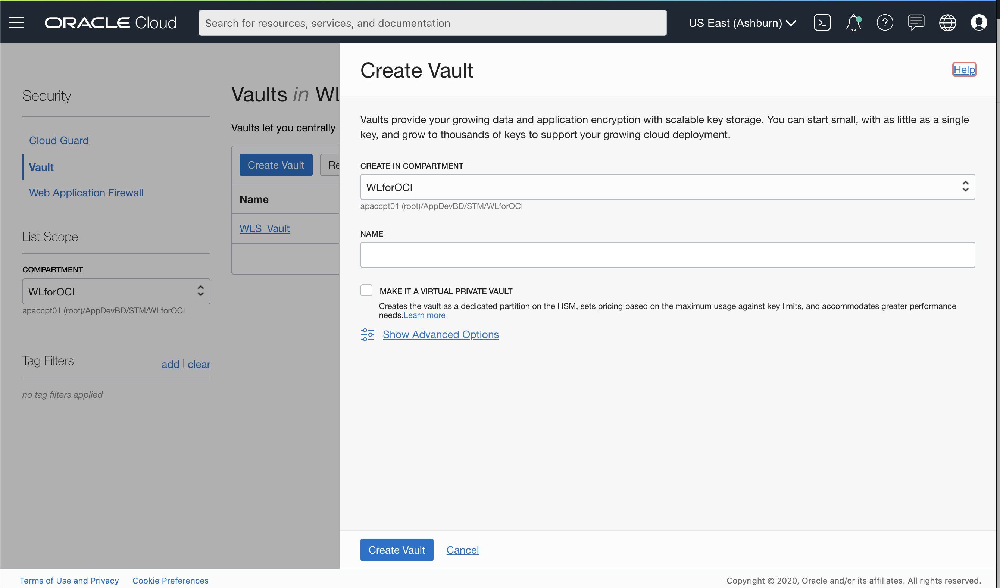
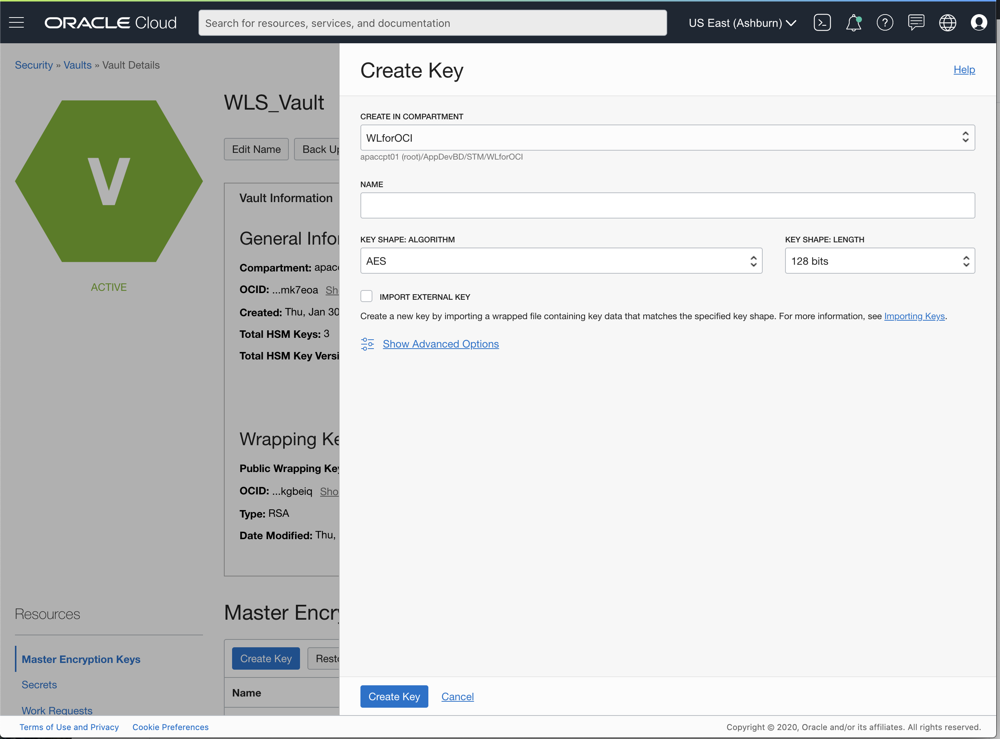

# WebLogic-Cloud-Workshop
Provisioning a Weblogic domain with WebLogic Cloud from OCI Marketplace

# 0. Prerequisites - What do you need?

- An [Oracle Cloud Infrastructure](https://cloud.oracle.com/en_US/cloud-infrastructure) enabled account. The tutorial has been tested using [Trial account](https://myservices.us.oraclecloud.com/mycloud/signup) (as of July 2020).

You must be an Oracle Cloud Infrastructure administrator. If you are not an administrator, you must be able to create dynamic groups and policies, and view tenancies in your tenancy. You must be able to create stacks, compute instances, networks (optional), and load balancers (optional) in the selected compartment. If you intend to create a domain that includes the Java Required Files (JRF) components, you must have database listing access in the compartment that contains your database.

- An Oracle Cloud Infrastructure compartment. In order to **create** a Compartment see [Managing Compartments](https://docs.oracle.com/pls/topic/lookup?ctx=cloud&id=oci_compartments).

- An Oracle Cloud Infrastructure policy that enables you to work with or create these resources in the selected compartment (if you're not an administrator):
    - Marketplace applications
    - Resource Manager stacks and jobs
    - Vaults, keys, and secrets
    - Compute instances, networks, and load balancers
See [Common Policies](https://docs.oracle.com/pls/topic/lookup?ctx=cloud&id=oci_policies). For a sample policy, download the [text](https://docs.oracle.com/en/cloud/paas/weblogic-cloud/tutorial-get-started/files/weblogic-cloud-policy.txt) file.

# 1. Cloud Shell

Oracle Cloud Infrastructure Cloud (OCI) Shell is a web browser-based terminal accessible from the Oracle Cloud Console. Cloud Shell is free to use (within monthly tenancy limits), and provides access to a Linux shell, with a pre-authenticated Oracle Cloud Infrastructure CLI and other useful tools for following Oracle Cloud Infrastructure service tutorials and labs. 

Cloud Shell is a feature available to all OCI users, accessible from the Console. Your Cloud Shell will appear in the Oracle Cloud Console as a persistent frame of the Console, and will stay active as you navigate to different pages of the Console.

**Getting Started with Cloud Shell**

To access Cloud Shell:

1. Login to the Console.

2. Click the Cloud Shell icon in the Console header. Note that the OCI CLI running in the Cloud Shell will execute commands against the region selected in the Console's Region selection menu when the Cloud Shell was started.


This will display the Cloud Shell in a "drawer" at the bottom of the console:


You can use the icons in the upper right corner of the Cloud Shell window to minimize, maximize, restart, and close your Cloud Shell session.

---

**Note:** For clipboard operations, Windows users can use Ctrl-C or Ctrl-Insert to copy, and Shift-Insert to paste. For Mac OS users, use Cmd-C to copy and Cmd-V to paste.

---


# 2. Create an SSH Key 

Create a secure shell (SSH) key pair so that you can access the compute instances in your Oracle WebLogic Server domains.

A key pair consists of a public key and a corresponding private key. When you create a domain using Oracle WebLogic Cloud, you specify the public key. You then access the compute instances from an SSH client using the private key.

In your CLoud Shell window, use the ssh-keygen utility:

```
$ ssh-keygen -b 2048 -t rsa -f mykey
    
$ cat mykey.pub  
```

---

**Note:** Keep a record of the output of the above **'cat mykey.pub'** command for later use in the lab.

---

# 3. Create a Vault and a Key

In your Cloud Shell window, type / paste the following comand:


1. Sign in to the Oracle Cloud Infrastructure console.

2. Click the  Navigation Menu icon and under Governance and Administration, select Security, and then click Vault.


3. Select your Compartment, if not already selected and Click Create Vault. 

4. For Name, enter WebLogicOCIVault

5. Click Create.



Wait for the vault to be created.

6. Click the new vault.

7. Click Master Encryption Keys, and then click Create Key. 



8. For Name, enter WebLogicOCIKey.

9. Then, click Create Key.

Wait for the key to be created and enabled before you create a secret.

# 4. Create a Secret for Your WebLogic Password

1. In the vault, click Secrets, and then click Create Secret.


2. For Name, enter WebLogicAdminSecret.

3. Select the key WebLogicOCIKey that you created.

4. For Secret Contents, enter the password you want to use for the WebLogic Server administrator.
The password must start with a letter, is between 8 and 30 characters long, contain at least one number, and, optionally, any number of the special characters ($ # _).

5. Click Create Secret.

Wait for the secret to be created.

6. Click the secret name.

Copy the secret's OCID.

---

**Note:** Keep a record of the secret's OCID for later use in the lab.

---


# 5. Provision a Domain in WebLogic Cloud from the OCI Markeplace

**Launch a Stack**

Sign in to Marketplace and specify initial stack information.

1. Sign in to the Oracle Cloud Infrastructure Console.

2. Click the  Navigation Menu icon and select Marketplace.


3. You can choose to browser-search for WebLogic Cloud, or for faster search you can apply the filters:

Type: Stack
Publisher: Oracle
Category: Application Development


3. Choose **WebLogic Cloud Enterprise Edition BYOL**; This brings you to the Stack Overview page:


4. Select a version of Oracle WebLogic Server 12c.
If there's more than one 12c patch, the latest patch is the default.

5. Select the compartment **"WLS_Compartment"** in which we will create the stack.


By default the stack compartment is used to contain the domain compute instances and network resources. If later on you specify a network compartment on the Configure Variables page of the Create Stack wizard, then only the compute instances are created in the stack compartment that you select here.

6. Select the Terms and Restrictions check box, and then click Launch Stack.


The Create Stack wizard is displayed.

**Specify Stack Information**


Specify the name, description, and tags for the stack.

8. On the Stack Information page of the Create Stack wizard, enter a name for your stack.

9. Enter a description for the stack (optional).

10. Specify one or more tags for your stack (optional).

11. Click Next.

The Configure Variables page opens.

**Configure WebLogic Instance Parameters**


Specify the parameters needed to configure the WebLogic instance domain.

12. In the WebLogic Server Instance section, enter the resource name prefix.(The maximum character length is 8.
This prefix is used by all the created resources.)

13. Select the WebLogic Server shape for the compute instances: **VM.Standard2.1**. (Fyi, only the following shapes are supported: VM.Standard2.x, VM.Standard.E2.x, BM.Standard2.x, BM.Standard.E2.x 

14. Enter the SSH public key. (See section #4)

15. Select the availability domain where you want to create the domain.**Choose one of the displyed ADs**

16. Select the number of managed servers you want to create. **Select 2**
The managed servers will be members of a cluster, unless you selected WebLogic Server Standard Edition.

17. Enter a user name for the WebLogic Server administrator. **Enter weblogic**

18. Enter an encrypted password for the WebLogic Server administrator. **Enter the value of Encrypted-data in the output of the terraform apply command that you run in section #7**

**Configure Advanced Parameters for a Domain**


19. Don't change / select WebLogic Server Instance Advanced Configuration

20. Network Compartment: Select **WLS_compartment**

21. VCN Strategy: Select **Create New VCN**

22. WLS Network: Enter **WLSCloudVCN** 

23. WLS Network CIDR: Keep the default

24. Subnet Strategy: Select **Create New Subnet**

25. Subnet Type: Keep the default **Use Public Subnet** selection.


26. Subnet span: Select **Regional Subnet**

27. Select **Provision Load Balancer**

28. LB Network CIDR: Keep the default

29. LB Shape: Select **400Mbps**

30. Do **NOT** select **Prepare Load Balancer for https**

31. Do **NOT** select **Enable authentification using Identity Cloud Service**

32. At the bottom of the Configure Variables page, click **Next**

You are now ready to create the stack.

33. Review the Stack configuration and Click **Create**


34. A Stack Job is being run and our WLS Server is being provisioned


35. While all resources being created we can check the Job Logs; it helps fixing potentially configuration errors if the provisioning fails


36. After a while (~ 15 minutes), the Job should complete with success


37. We can check the Outputs section of Job Resources and check for two important values:

- Sample Application URL
- WebLogic Server Administration Console


38. Let's check the WLS admin console of the newly created WebLogic Server

- As we have chosen a Public Subnet for the WLS network, both Compute instances that have been created have public IPs associated.
- In a new browser window, enter the **URL** as displayed in **WebLogic Server Administration Console**
- Login with weblogic username (weblogic) and the **plain text password** you selected in section #4


39. We can see that our domain has one admin server and two managed servers:


40. Let's check the WLS sample-app deployed in the newly created WebLogic Server

- In a new browser window, enter the **URL** as displayed in **WebLogic Server sample application**


41. We can check the Compute Instances to see what has been provisioned 

From  choose Core Infrastructure -> Compute -> Instances:


42. We can see two instances having our prefix mentioned during Stack configuration; one of them runs the admin server and a managed server and the other runs the second managed server:


**Congratulations! Your WLS domain is up & running!**
